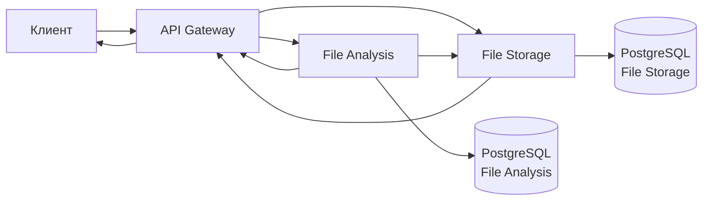

# Antiplagiarism System

## Краткое описание

Серверная часть для загрузки файлов и обнаружения плагиата в студенческих работах. Реализована с использованием микросервисной архитектуры.

## Описание сервисов

1. API Gateway (Порт: 8080)

- Единая точка входа для клиентских запросов

- Проксирует запросы к соответствующим микросервисам

- Агрегирует результаты от нескольких сервисов

2. File Storage Service (Порт: 8081)

- Загрузка, скачивание и получение метаданных файлов

- Вычисление контрольных сумм (MD5, SHA256) для проверки дубликатов

- Хранение файлов в файловой системе

3. File Analysis Service (Порт: 8082)

- Анализ файлов на плагиата (проверяется есть ли уже такой же файл в системе)

- Генерация отчетов о схожести работ

- Хранение истории анализов

- Определение процентного сходства между работами(TODO)

## API

Спецификация лежит в /api/openapi/

## Взаимодействие между сервисами



## Контейнеризация
В корне проекта есть docker-compose.yml, который поднимает все сервисы

## Запуск 
1. Из корня проекта соберите и запустите контейнеры:
```sh
docker compose up -d --build
```
2. Проверьте логи сервисов:
```sh
docker compose logs -f api-gateway
```

## Архитектура
```
sd_hw3/
├── api/ - OpenAPI спецификации и сгенерированный код
├── cmd/- Точки входа сервисов
│   ├── file-analysis/ - File Analysis сервис
│   ├── file-storage/ - File Storage сервис
│   └── gateway/ - API Gateway
├── internal/ - Внутренние пакеты
│   ├── file-analysis/ - Логика File Analysis
│   ├── file-storage/ - Логика File Storage
│   └── gateway/ - Логика Gateway
├── migrations/ - Миграции баз данных
├── pkg/ - Общие пакеты
├── docker-compose.yaml - Конфигурация Docker Compose
└── README.md - Документация
```